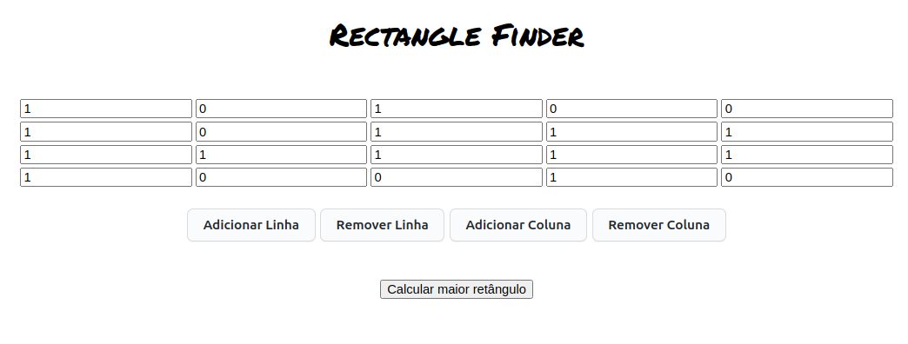

# React + Vite

Comandos básicos para o funcionamento do projeto (localmente):<br/>
 * Clonar o repositório
```bash
git clone git@github.com:Yoosephh/rectangle-finder-front.git
```
* Baixar as dependências
```bash
npm i
```
* Executar o projeto:
```bash
npm run dev
```
Deploy: <br />
https://rectangle-finder-front.vercel.app/